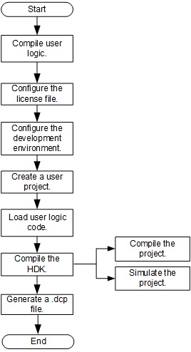

Implementation Process of Vivado-based Hardware Development
=======

[切换到中文版](./Implementation_Process_of_Vivado_based_Hardware_Development_cn.md)

This section describes the Vivado operation process and development environment configuration.

Contents
-------
[Vivado-based Operation Process](Vivado-based Operation Process)

[Configuring the Development Environment](#Configuring the Development Environment)

[Creating a User Project](#Creating a User Project)

[FPGA Development](#FPGA Development)

[FPGA Simulation] (#FPGA Simulation)

[Configuring a Project](#Configuring a Project)

[Version Compilation](#Version Compilation)

Vivado-based Operation Process
-------

### User Operation Process

#### The following figure describes the user operation process.

#### The following table describes each step of the user operation process.

| Procedure                              | Operation                                | Description                              |
| -------------------------------------- | ---------------------------------------- | ---------------------------------------- |
| Compile user logic.                    | Compile user logic.                      | Compile user logic based on the actual requirements. The FPGA HDK supports Verilog or VHDL for FPGA development. |
| Configure the license file.            | Configure the license file.              | Enter the correct directory where the license file is located. Otherwise, the license file will fail to be obtained. Configuring the license is a prerequisite for configuring the development environment. |
| Configure the development environment. | Configure the hardware development environment. | Run the setup.sh script to configure the hardware development environment. |
| Create a user project.                 | Create a user project.                   | User projects are stored in a default directory. Run a command to create a project. |
| Compile code or load user logic code.  | Compile code or load user logic code to the project. | The source files must be stored in the **src** folder in the directory where the user project is located. |
| Compile the HDK.                       | Simulate the project.                    | Configure simulation macros and parameters, compile incentives, compile test cases, configure compilation scripts, and perform simulation. |
|                                        |                                          | Compile the project.                     |
| Generate a .dcp file.                  | Generate a .dcp files.                   | The .dcp file is stored in .../prj/build/checkpoints/to_facs/. |

Configuring the Development Environment
--------

The FPGA HDK is stored in the `huaweicloud-fpga/fp1` directory on a VM by default. Configure the hardware development environment before FPGA development.

### Step 1 Configure the license file of Vivado.

Open the `setup.cfg` file in `huaweicloud-fpga/fp1/` and set `XILINX_LIC_SETUP` to the IP address of the license server.

CN North:
`XILINX_LIC_SETUP="2100@100.125.1.240:2100@100.125.1.245"`

CN South:
`XILINX_LIC_SETUP="2100@100.125.16.137:2100@100.125.16.138"`

CN East:
`XILINX_LIC_SETUP="2100@100.125.17.108:2100@100.125.17.109"`

**Note** 
Only user root has the right to use the Xilinx license file provided by Huawei.

### Step 2 Configure the development environment.

Run the `setup.sh` script to configure the hardware development environment.

`cd huaweicloud-fpga/fp1`  
`export HW_FPGA_DIR=$(pwd)`  
`source $HW_FPGA_DIR/setup.sh`

**Note** 
You can copy all HDK files to any directory on a VM. The following sections use the default directory as an example.

Creating a User Project
------------

By default, user projects are stored in the `$HW_FPGA_DIR/hardware/ vivado_design/user` directory. Run the `create_prj. sh` script to create a project.

`cd $HW_FPGA_DIR/hardware/vivado_design/user`  
`sh create_prj.sh <usr_prj_name>`

FPGA Development
--------

The HDK supports Verilog and VHDL for FPGA development. The source files must be stored in the src folder in the <usr_prj_name> directory.

`cd $HW_FPGA_DIR/hardware/vivado_design/user/<usr_prj_name>/src`

FPGA Simulation
--------

The FPGA HDK provides a general-purpose FPGA simulation platform based on the SystemVerilog-2012 syntax standard. The platform supports mainstream simulation tools, and the platform architecture supports decoupling of Testbench and Testcase to enable quick simulation platform building. Testbench is located in the `$HW_FPGA_DIR/hardware/vivado_design/lib/sim` directory.

To modify the simulation platform according to UL, perform the following steps:

###   Step 1 Configure simulation macros and parameters.

`cd $HW_FPGA_DIR/hardware/vivado_design/user/<usr_prj_name>/sim/scripts`

To enable the simulation platform macro SIM_ON, modify the `project_settings.cfg` file as follows:

`#SIM_MACRO=“<SIM_ON>”`

### Step 2 Compile the simulator.

`cd $HW_FPGA_DIR/hardware/vivado_design/vivado_design/lib/sim/doc/`

Use APIs provided in `quick_start.md` to compile incentives and send them to the simulation platform.

### Step 3 Compile test cases.

`cd $HW_FPGA_DIR/hardware/vivado_design/user/<usr_prj_name>/sim/tests`

Use the C or SystemVerilog language to design test cases.

### Step 4 Configure compilation scripts.

`cd $HW_FPGA_DIR/hardware/vivado_design/user/<usr_prj_name>/sim`

Configure the simulation tools and test case names in the Makefile file.

### Step 5 Implement the simulation.

`cd $HW_FPGA_DIR/hardware/vivado_design/user/<usr_prj_name>/sim`

`make TC=<TC_NAME>`

Note
For details, see `$HW_FPGA_DIR/hardware/vivado_design/lib/sim/doc/quick_start.md`.

Configuring a Project
--------

The FPGA HDK supports one-click project building. Modify the Makefile file in the `$HW_FPGA_DIR/hardware/vivado_design/user/<usr_prj_name>/prj` directory to configure a project.

### The configuration items include:

-   Project name

-   Top-layer module name

-   Synthesis policy

-   Placing and routing policy

-   Project building mode

-   User logic restrictions

**Note** 
For details, see the `usr_prj_cfg` file.

Version Compilation
------------

Run the build.sh script to complete the synthesis process and the placing and routing process in one-click mode.

`cd $HW_FPGA_DIR/hardware/vivado_design/user/<usr_prj_name>/prj`  
`sh ./build.sh`

For details about how to encrypt source files and generate target files, see `huaweicloud-fpga/fp1/hardware/vivado_design/lib/template/prj/README.md`.

