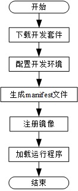

基于SDAccel的线下开发线上使用流程说明
=======================

**说明:** 
本文档基于用户线下已实现kernel部分的编译工作，并已生成相应的xclbin文件。

[Switch to the English version](./SDAccel-based_offline_development_online_use_process_guidance.md)

目录
-------------------------

[总体操作流程](#sec-1)

[下载开发套件](#sec-2)

[配置开发环境](#sec-3)

[生成manifest文件](#sec-4)

[注册镜像](#sec-5)

[加载运行程序](#sec-6)

<a id="sec-1" name="sec-1"></a>
总体操作流程
------------



<a id="sec-2" name="sec-2"></a>
下载开发套件
------------

用户在申请到相应的华为云虚拟机之后，下载开发套件到所申请的虚拟机，具体下载方式如下：

+ 对于https连接执行`git clone https://github.com/Huawei/huaweicloud-fpga.git`命令下载。

+ 对于ssh连接执行`git clone git@github.com:Huawei/huaweicloud-fpga.git`命令下载。

<a id="sec-3" name="sec-3"></a>
配置开发环境
------------

**说明:**
华为提供的Xilinx软件License仅限root账号使用。

用户进入VM后，SDAccel默认存放在`huaweicloud-fpga/fp1`目录下。在进行SDAccel开发前，用户需要完成对硬件开发环境的配置。

#### 设置内网DNS

设置内网DNS请参考根目录`huaweicloud-fpga`下README_CN.md中1.2.2章节。

#### FPGA镜像管理工具的安装和配置

FPGA镜像管理工具的安装和配置请参考根目录`huaweicloud-fpga`下README_CN.md中1.2.3章节。

#### 设置EDA工具开发模式、版本号

用户打开开发套件`huaweicloud-fpga/fp1/`下的`setup.cfg`文件，将FPGA线上开发工具`FPGA_DEVELOP_MODE`设置为SDAccel ，将`VIVADO_VER_REQ`设置为2017.4.op：

```bash
FPGA_DEVELOP_MODE="sdx"
VIVADO_VER_REQ="2017.4.op"
```

#### 设置EDA工具License

将`setup.cfg`文件中`XILINX_LIC_SETUP`的值配置为License服务器的IP地址，配置如下（此处需要根据用户所申请虚拟机的位置做相应配置）：

华北：
`XILINX_LIC_SETUP="2100@100.125.1.240:2100@100.125.1.251"`

华南：
`XILINX_LIC_SETUP="2100@100.125.16.137:2100@100.125.16.138"`

华东：
`XILINX_LIC_SETUP="2100@100.125.17.108:2100@100.125.17.109"`

#### 完成开发环境配置

运行`setup.sh`脚本完成硬件开发环境的配置，执行以下命令运行`setup.sh`脚本。

```bash
cd huaweicloud-fpga/fp1 
export HW_FPGA_DIR=$(pwd)
source $HW_FPGA_DIR/setup.sh
```

<a id="sec-4" name="sec-4"></a>
生成manifest文件
------------

创建工程，用于存放xclbin文件：

```bash
cd huaweicloud-fpga/fp1/hardware/sdaccel_design/user
sh create_prj.sh usr_prj temp_cl
```

用户上传线下生成的`xclbin`文件到用户创建的文件夹`usr_prj/prj/bin/`中。

由于是线下开发，未生成注册镜像环节用到的manifest.txt文件，因此需要单独生成，生成方式如下：

```bash
cd huaweicloud-fpga/fp1/hardware/sdaccel_design/user/usr_prj/scripts
sh ../../../lib/scripts/creat_ocl_manifest.sh ./
```

<a id="sec-5" name="sec-5"></a>
注册镜像
------------

注册镜像流程部分请参考根目录`huaweicloud-fpga`下README_CN.md中2.1.2章节。具体如下：

```bash
sh AEI_Register.sh -n [AEI_name] -d [AEI_Description]
```

<a id="sec-6" name="sec-6"></a>
加载运行程序
------------

创建用户驱动软件文件夹：

```bash
cd huaweicloud-fpga/fp1/software/app/sdaccel_app
mkdir usr_app
cp -r ./mmult_hls/* ./usr_app
cd usr_app
```

用户上传软件驱动到用户创建的文件夹`usr_app`中，替换掉`test-cl.cpp`文件。

执行run.sh完成硬件的加载与测试，具体步骤如下：

```bash
make
sh run.sh mmult huaweicloud-fpga/fp1/hardware/sdaccel_design/user/usr_prj/prj/bin/xxx.xclbin
```

**说明:**

xxx.xclbin文件为用户所上传的文件名。
run.sh具体使用请执行sh run.sh -h查看。